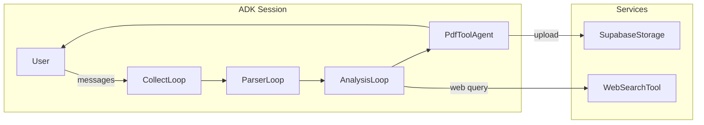

# Reframe-APD Chat Workflow – **ADK (Adaptive Dialog Kit)** Specification

> **Scope** Deliver a single‑session CBT *cognitive‑reframing* intervention for Avoidant Personality Disorder (APD) using **ADK Loop/Tool/Sequential agents**. This document defines architecture, SDK primitives, code layout, testing, and deployment for both local `adk web` runs and Google Cloud Run production.

---

## 1  Overview

* **User Journey** User enters a distressing automatic thought → chatbot collects context (≤ 4 turns) → model reframes the thought & proposes ≤ 10‑min action → user downloads anonymised PDF summary.
* **Clinical Model** CBT cognitive restructuring · trauma‑informed interviewing · crisis escalation · cultural humility.
* **Implementation Stack** Python 3.12 · **ADK** 0.8+ · Google Gemini 1.5 Pro · Supabase Storage · Doppler / Secret Manager.

---

## 2  Functional Requirements

| ID   | Requirement                                                                                     |
| ---- | ----------------------------------------------------------------------------------------------- |
| FR‑1 | Complete data collection in ≤ 4 user turns.                                                     |
| FR‑2 | Detect cognitive distortion + craft ≤ 40‑word balanced thought + ≤ 10‑min micro‑action.         |
| FR‑3 | Measure pre/post confidence (0–100) and report Δconfidence.                                     |
| FR‑4 | Export anonymised PDF summary and return public URL.                                            |
| FR‑5 | Trigger crisis protocol with EU/ES hotlines on self‑harm cues.                                  |
| FR‑6 | Outputs must respect cultural & neurodivergent considerations (pronouns, collectivist framing). |
| FR‑7 | Secrets injected at runtime via Doppler (dev) and Cloud Run Secret Manager (prod).              |
| FR‑8 | ≥ 90 % unit and ≥ 80 % integration test coverage.                                               |

---

## 3  Non‑Functional Requirements

* **Latency** < 1.5 s per LLM call (95‑percentile).
* **Uptime** > 99 % on Cloud Run single‑region deploy.
* **Privacy** No PII in logs; PDFs redacted by default.
* **Compliance** GDPR · LOPDGDD · EU AI Act safeguards.
* **Extensibility** All prompt keys centralised in `Settings` for hot‑swap.

---

## 4  High‑Level Architecture



### 4.1  Conversation Phases (explicit ADK steps)

| Phase     | ADK Agent        | Tool(s)         | State Keys Written        |
| --------- | ---------------- | --------------- | ------------------------- |
| Collect   | **CollectLoop**  | `ExitLoopTool`  | `conv_raw`                |
| Parse     | **ParserLoop**   | —               | `parsed`                  |
| Reframe   | **AnalysisLoop** | `WebSearchTool` | `analysis`, `web_lookups` |
| Summarise | **PdfToolAgent** | `pdf_generator` | `pdf_url`                 |

`RootSequentialAgent.steps = [CollectLoop, ParserLoop, AnalysisLoop, PdfToolAgent]`.

---

## 5  Code Scaffolding

```text
app/
  agents/
    collect_loop.py     # LoopAgent ①
    parser_loop.py      # LoopAgent ②
    analysis_loop.py    # LoopAgent ③
    pdf_agent.py        # ToolAgent ④
  tools/
    exit_loop.py
    pdf_generator.py
    web_search_tool.py
  callbacks/
    safety_filters.py
    lang_detect.py
    transcript_acc.py
  services/
    persistence/supabase.py
    prompts/langfuse_cli.py
    tracing/langfuse_cli.py
  config/base.py
```

### 5.1  Key ADK Primitives

| ADK Class         | Purpose in Reframe                                           |
| ----------------- | ------------------------------------------------------------ |
| `LoopAgent`       | Iterative LLM‑driven dialog with internal stopping criteria. |
| `ToolAgent`       | Executes side‑effectful tool once and writes to `state`.     |
| `SequentialAgent` | Orchestrates fixed pipeline of agents.                       |
| `BaseTool`        | Reusable, schema‑validated Python function callable by LLM.  |

---

## 6  Core Components

### 6.1  Collectors

* **collect\_llm.py** – Gemini‑powered; prompt key `intake-agent-adk-instructions`.
* **CollectLoop** – ≤ 4 turns; early exit via `ExitLoopTool`.

### 6.2  Parser

* **parser.py** – LLM converts transcript → JSON; prompt key `intake-parser-agent-adk-instructions`.
* **ParserLoop** – Retries until valid JSON or `max_iterations` = 3.

### 6.3  Analyst

* **analysis\_llm.py** – Distortion detection, reframe, micro‑action; tools = `[WebSearchTool]`; prompt key `reframe-agent-adk-instructions`.
* **AnalysisLoop** – Performs crisis check; writes `analysis` & `web_lookups`.

### 6.4  PDF Generator

* **pdf\_generator.py** – Builds PDF with ReportLab; embeds charts.
* **PdfToolAgent** – Uploads to Supabase Storage → returns public URL.

### 6.5  Tools

| Tool            | Purpose                                       |
| --------------- | --------------------------------------------- |
| `ExitLoopTool`  | Allows LLM/User to end collection loop early. |
| `WebSearchTool` | Fetches up‑to‑date evidence; logs citations.  |
| `pdf_generator` | Converts session dict → PDF bytes.            |

### 6.6  Callbacks

* **SafetyFilters** – Crisis keywords, policy compliance.
* **LangDetect** – Non‑ES/EN detection → fallback.
* **TranscriptAccumulator** – Streams transcript into `state["conv_raw"]`.

---

## 7  Data Model (ADK `state`)

| Key           | Producer     | Consumer     | Description                                     |
| ------------- | ------------ | ------------ | ----------------------------------------------- |
| `conv_raw`    | CollectLoop  | PdfToolAgent | Full chat transcript.                           |
| `parsed`      | ParserLoop   | AnalysisLoop | JSON: trigger, thought, emotion, extras.        |
| `analysis`    | AnalysisLoop | PdfToolAgent | Distortion, reframe, micro‑action, Δconfidence. |
| `web_lookups` | AnalysisLoop | PdfToolAgent | List of citation dicts.                         |
| `pdf_url`     | PdfToolAgent | —            | HTTPS link to PDF.                              |

---

## 8  Configuration & Secrets

| Variable                        | Description    | Example                                         |
| ------------------------------- | -------------- | ----------------------------------------------- |
| `GOOGLE_API_KEY`                | Gemini API key | Secret Manager                                  |
| `SUPABASE_URL` / `SUPABASE_KEY` | Object storage | Doppler / Secret Manager                        |
| `Settings.google_ai_model`      | Default LLM id | `"gemini-1.5-pro"`                              |
| `*_agent_instruction_key`       | 4 prompt keys  | Stored in Supabase → pulled by `prompt_manager` |

---

## 9  Deployment

### 9.1  Local Development

```bash
doppler run -p app-all-secrets -c dev_reframe -- \
  python -m google.adk.cli web --port 8000 app/agents
```

Visit [http://localhost:8000](http://localhost:8000) – hot‑reload enabled.

### 9.2  Google Cloud Run

1. **Build**: `gcloud builds submit -t europe-docker.pkg.dev/…/reframe-adk:latest .`
2. **Deploy**:

   ```bash
   gcloud run deploy reframe-adk \
     --image europe-docker.pkg.dev/…/reframe-adk:latest \
     --region europe-west1 \
     --port 8000 \
     --allow-unauthenticated \
     --set-secrets GOOGLE_API_KEY=projects/…/secrets/gemini_key:latest \
                    SUPABASE_KEY=projects/…/secrets/supabase_key:latest
   ```
3. Autoscaling: min 0, max 1 (single‑session semantics).

### 9.3  Observability

* **Langfuse** traces via `services/tracing/langfuse_cli.py`.
* Cloud Run structured logs with traceId / severity fields.

---

## 10  Security & Compliance

* **GDPR / LOPDGDD** User may request deletion; transcripts hashed.
* **Encryption** Secrets via Secret Manager; PDFs encrypted at rest.
* **Safety** Crisis protocol with ES hotlines; automated + human escalation.
* **Audit** Prompt versions & tool arguments logged via Langfuse.

---

## 11  Testing Strategy

| Layer       | Status | Examples                                         |
| ----------- | ------ | ------------------------------------------------ |
| Unit        | ✅      | `test_collect_loop.py`, `test_parser_loop.py`, … |
| Integration | ✅      | `tests/integration/test_happy_flow.py`           |
| Load        | ☐      | k6 script @ 10 rps for 60 s                      |

CI: `pytest -q --cov=app --cov-fail-under=90`.

---


**Document version:** v0.4 • 1 Jul 2025
